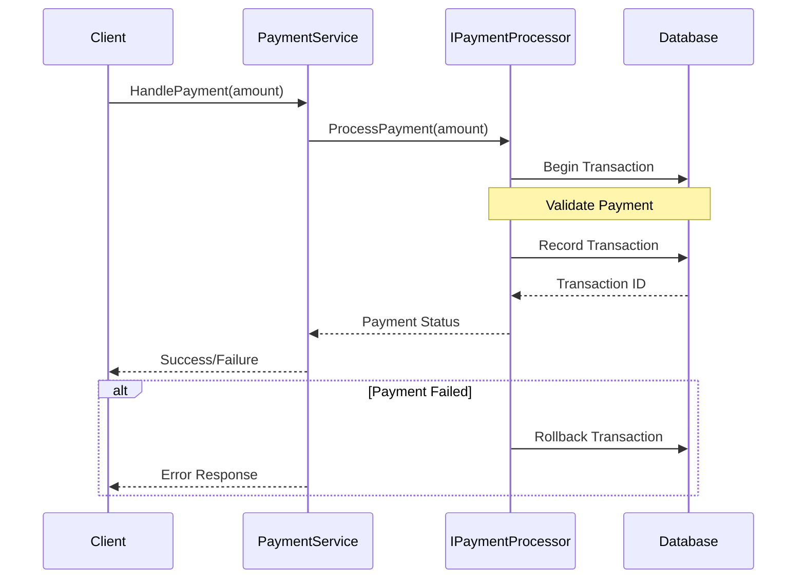
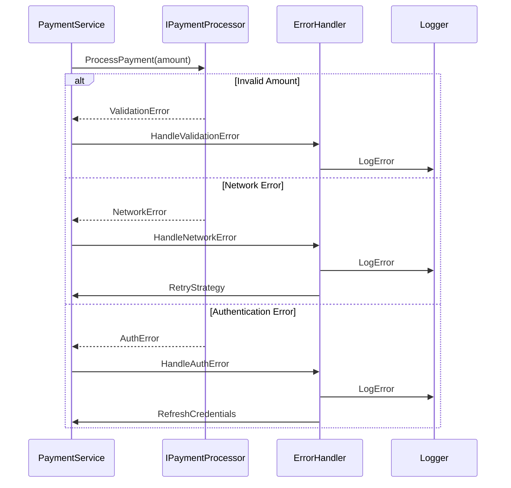

# Payment Service Flow Diagrams

## Payment Processing Sequence

```mermaid
sequenceDiagram
    participant C as Client
    participant PS as PaymentService
    participant PP as IPaymentProcessor
    participant DB as Database

    C->>PS: HandlePayment(amount)
    PS->>PP: ProcessPayment(amount)
    PP->>DB: Begin Transaction
    Note over PP,DB: Validate Payment
    PP->>DB: Record Transaction
    DB-->>PP: Transaction ID
    PP-->>PS: Payment Status
    PS-->>C: Success/Failure

    alt Payment Failed
        PP->>DB: Rollback Transaction
        PS-->>C: Error Response
    end
```

## Error Handling Flow

```mermaid
sequenceDiagram
    participant PS as PaymentService
    participant PP as IPaymentProcessor
    participant H as ErrorHandler
    participant L as Logger

    PS->>PP: ProcessPayment(amount)
    alt Invalid Amount
        PP-->>PS: ValidationError
        PS->>H: HandleValidationError
        H->>L: LogError
    else Network Error
        PP-->>PS: NetworkError
        PS->>H: HandleNetworkError
        H->>L: LogError
        H->>PS: RetryStrategy
    else Authentication Error
        PP-->>PS: AuthError
        PS->>H: HandleAuthError
        H->>L: LogError
        H->>PS: RefreshCredentials
    end
```

## Version: 1.0.0
Last updated: 2024-03-25